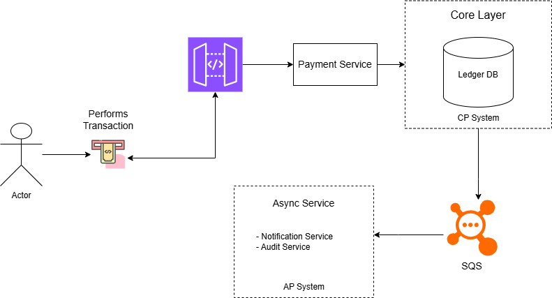

# Payment System Design

A high-level system design for a payment processing platform, split along CAP-theorem boundaries: a strongly consistent core for money movement and an eventually consistent async tier for side-effects.

## Architecture

The source diagram is in [`Architecture.drawio`](Architecture.drawio) (edit at [app.diagrams.net](https://app.diagrams.net)).

## Flow

1. **Actor** initiates a transaction at a client terminal.
2. The request is routed through an **API Gateway**.
3. The **Payment Service** validates and orchestrates the transaction.
4. State is committed to the **Ledger DB** inside the **Core Layer (CP System)**.
5. A message is published to **SQS** to fan out downstream work.
6. The **Async Service (AP System)** consumes events and runs **Notification** and **Audit** workflows.

## Components

| Component | Role | Tier |
|---|---|---|
| API Gateway | Request entry point, auth, routing | Edge |
| Payment Service | Transaction orchestration and validation | Core |
| Ledger DB | Source of truth for balances and transactions | Core (CP) |
| SQS | Durable decoupling between core and async work | Messaging |
| Notification Service | Sends transaction notifications | Async (AP) |
| Audit Service | Records audit trail for compliance | Async (AP) |

## Design Rationale

- **CP core**: money movement requires strong consistency — the ledger cannot tolerate split-brain or lost writes.
- **AP async**: notifications and audit trails can tolerate brief delays in exchange for higher availability and decoupling.
- **SQS as the seam**: isolates failure between tiers so an async outage never blocks a payment.
